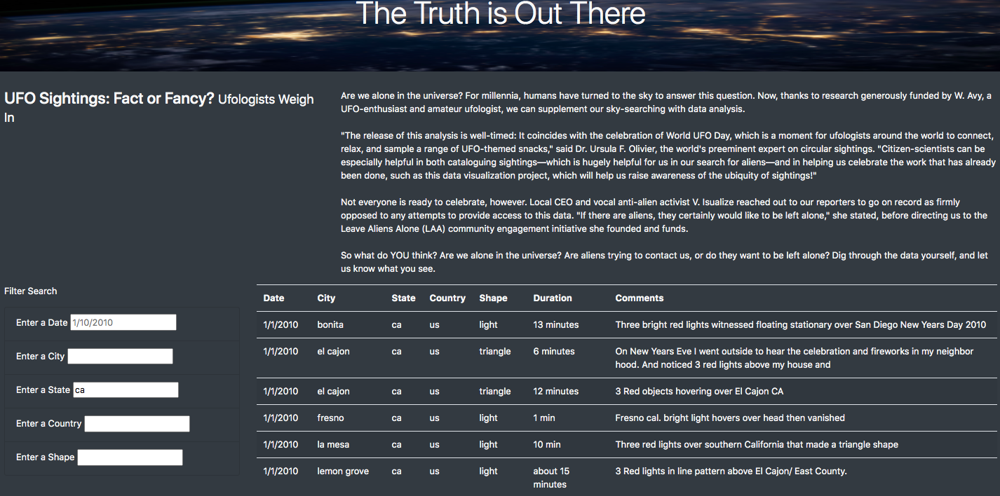
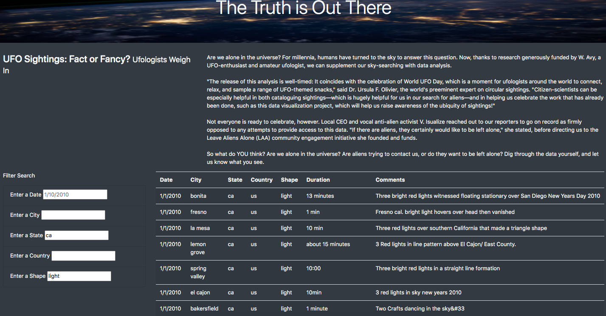

# UFOs

## Overview of Project
The purpose of this analysis is to provide a more in-depth analysis of UFO sightings by allowing users to filter for multiple criteria at the same time such as city, state, country, and shape. 

## Results
By using the table to the left, you are able to filter for specific search criteria such as date, city, state, country, and shape. In my example below, I am filtering based on two criteria: "ca" for the state and "light" for the shape.

I first enter "ca" into the State filter box to only see the results for "ca". 

I then type in "light" into the Shape filter box to further filter my search results to only show results under these two parameters. 

The results to the right will update once parameters are entered into the table filter. 

## Summary
In a summary statement, describe one drawback of this new design and two recommendations for further development.

One drawback I noticed was that I initially typed in "CA" in uppercase when filtering for the State, but nothing appeared, making it seem like there were no results, but that is because the case is lowercase and results will only appear if "ca" is entered. 

Two recommendations:
- I think it is beneficial to add in a statement "No results found" if that is the case if filtering does not render any results. Otherwise, it is unclear whether the data is loading or if there are truly no results.
- Adding an "Enter" or "Search" button at the bottom of the table can reenforce that the search has initiated and complete the search. 

